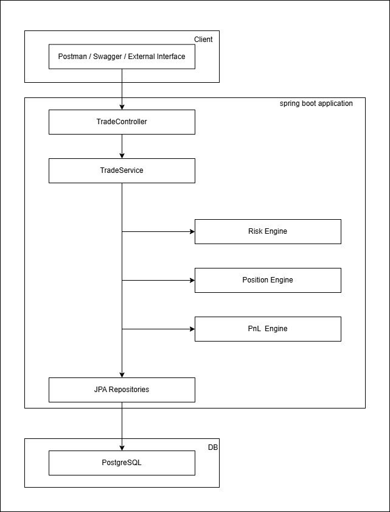
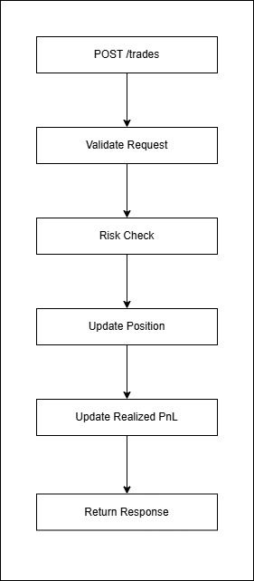
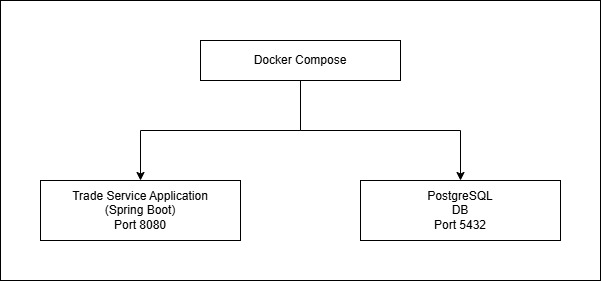
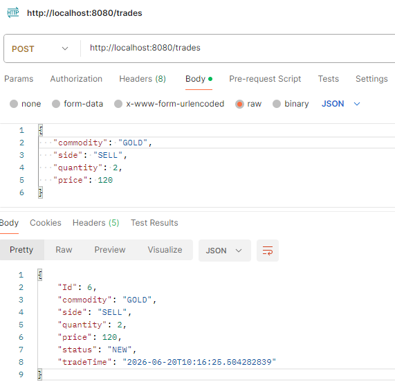
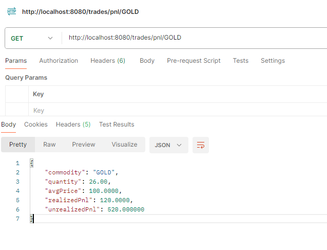
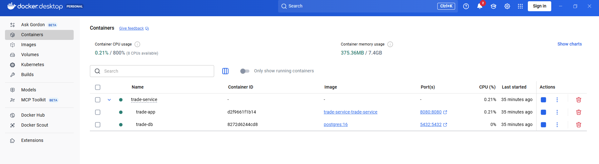
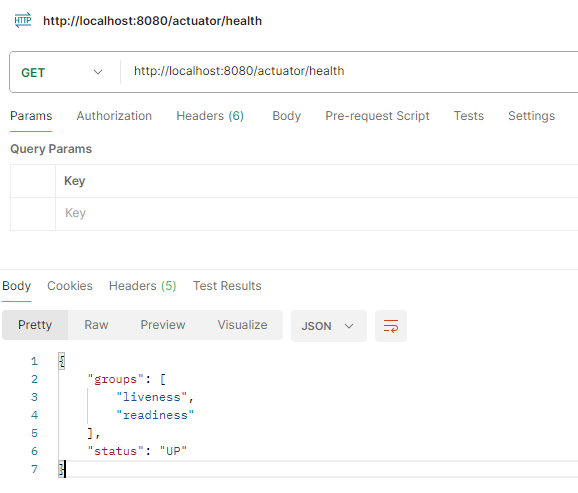

# Commodity Trading and Risk Management Platform

## Overview

A backend trading platform built using Java Spring Boot and PostgreSQL that supports trade booking, position management, risk validation, and profit & loss (PnL) calculations.

The project demonstrates backend engineering concepts including:

* REST API development
* Layered Architecture (Controller → Service → Repository)
* JPA/Hibernate ORM
* PostgreSQL
* Docker & Docker Compose
* Global Exception Handling
* Validation Layer
* Structured Logging (SLF4J)
* Spring Boot Actuator
* Unit Testing
* Integration Testing using Testcontainers

### Note:- For verification, see the [API Endpoints](#api-endpoints) and [Docker Desktop](#docker-desktop) sections.

---

## Business Problem

Commodity trading firms need systems capable of:

* Booking commodity trades
* Tracking net positions
* Enforcing risk limits
* Calculating realized and unrealized profit and loss
* Providing reliable APIs for downstream systems

This project simulates a simplified commodity trading workflow while incorporating production-grade backend engineering practices.

---

## Architecture

### High-Level Architecture



### Trade Processing Flow



### Docker Deployment Architecture



## API Endpoints

### Book Trade

```http
POST /trades
```
Sample Request and Response


---

### Get PnL

```http
GET /trades/pnl/{commodity}
```

Sample Response



---

## Database Design

### trades

| Column     | Description      |
| ---------- | ---------------- |
| id         | Trade Identifier |
| commodity  | Commodity Name   |
| side       | BUY / SELL       |
| quantity   | Trade Quantity   |
| price      | Trade Price      |
| status     | Trade Status     |
| trade_time | Trade Timestamp  |

### positions

| Column        | Description            |
| ------------- | ---------------------- |
| id            | Position Identifier    |
| commodity     | Commodity Name         |
| quantity      | Net Position           |
| average_price | Weighted Average Price |
| realized_pnl  | Realized Profit & Loss |

### risk_limit

| Column       | Description              |
| ------------ | ------------------------ |
| id           | Risk Limit Identifier    |
| commodity    | Commodity Name           |
| max_position | Maximum Allowed Position |

---

## Docker Desktop

### Running application and DB



## Running Locally

### Prerequisites

* Java 21
* Maven
* PostgreSQL

### Build

```bash
mvn clean package
```

### Run

```bash
mvn spring-boot:run
```

---

## Running with Docker

### Build and Start

```bash
docker compose up --build
```

### Stop

```bash
docker compose down
```

### Remove Containers and Volumes

```bash
docker compose down -v
```

---

## Testing

### Unit Tests

Run:

```bash
mvn test
```

Covered areas:

* Position Engine
* Risk Engine
* PnL Engine

### Integration Tests

Integration tests use:

* Spring Boot Test
* PostgreSQL Testcontainers

These tests validate:

* REST APIs
* Database interactions
* End-to-end trade processing

---

## Monitoring

### Health Endpoint

```http
GET /actuator/health
```

Sample Response



## Key Features

### Trade Management

* Book BUY and SELL commodity trades
* Persist trades in PostgreSQL
* Maintain trade history

### Position Management

* Net positions automatically
* Support long and short positions
* Handle partial reductions
* Handle position flips

### Risk Management

* Position limit validation
* Database-driven risk limits
* Risk breach prevention

### PnL Engine

* Average price calculation
* Realized PnL tracking
* Unrealized PnL calculation

### Production Readiness

* Global exception handling
* Request validation
* Structured logging
* Health monitoring using Actuator

### Testing

* Unit tests for business logic
* Integration tests using PostgreSQL Testcontainers

---

## Future Enhancements

Potential enhancements include:

* Kubernetes deployment
* Kafka event publishing
* Market data integration
* Audit trail support
* Trade lifecycle workflow
* Role-based access control
* Redis caching
* Advanced risk metrics

---

## Learning Outcomes

This project helped reinforce:

* Spring Boot architecture
* Hibernate/JPA ORM concepts
* Financial domain modeling
* Position netting logic
* Risk management workflows
* PnL calculations
* Production-ready backend practices
* Docker-based deployments
* Integration testing with Testcontainers

---

## Author

Backend Engineering Portfolio Project

Focus Areas:

* Java Backend Development
* Spring Boot
* Financial Systems
* Distributed Systems Foundations
* Cloud-Native Backend Engineering
